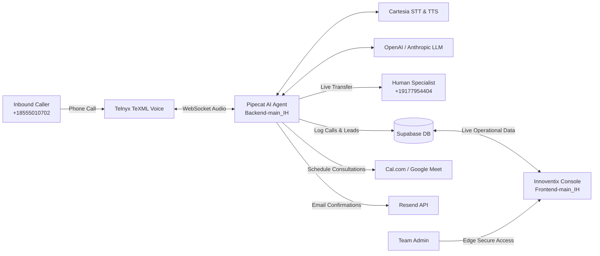

# Innoventix Hub — Inbound AI Voice Agent System & Management Platform

[](https://nextjs.org/)
[](https://www.python.org/)
[](https://www.typescriptlang.org/)
[](https://supabase.com/)
[](https://telnyx.com/)
[](https://cartesia.ai/)

A production-grade, end-to-end inbound voice automation platform and management console built for **Innoventix Hub** ([innoventixhub.tech](https://innoventixhub.tech)).

This repository contains both the real-time AI voice receptionist backend and the administrative dashboard frontend:

```text
Innoventixhub_inbound-agent/
├── Backend-main_IH/      # Python Pipecat AI Voice Agent, Telephony & Integrations
├── Frontend-main_IH/     # Next.js 14 Management Console & Analytics Dashboard
└── README.md             # Monorepo documentation
```

### 🌿 Git Branch Structure
- **`main`**: Production release hosting the verified architecture (`Backend-main_IH/` and `Frontend-main_IH/`).
- **`test`**: Testing and staging environment (`Backend-test_IH/` and `Frontend-test_IH/`).

---

## ⚡ System Architecture & Call Flow



---

## 📦 Subsystems & Modules

### 1. [Inbound Voice Agent (`Backend-main_IH/`)](./Backend-main_IH)
The core Python voice agent powered by **Pipecat 1.8.1**:
- **Sub-Second Telephony Pipeline:** Telnyx WebSockets, Cartesia Ink-Whisper STT, and Sonic TTS with Silero VAD.
- **Smart AI Receptionist ("Clara"):** Answers inquiries across AI Automation, Web Development, Mobile Apps, and SEO.
- **Cal.com & Google Meet Integration:** Live slot availability checking and meeting bookings with automated Resend email confirmations.
- **Live Human Transfer Bridge:** Instant call bridging to a human specialist (`+19177954404`) via Telnyx Call Control API.
- **High-Precision AI Outcome Classifier:** Classifies calls into `meeting_booked`, `warm_lead`, `info_inquiry`, `transferred`, and `dropped_call` directly into Supabase.
- **Automated Cloudflare Tunneling:** One-click startup with automatic TeXML webhook registration (`auto_tunnel.py`).

👉 See [`Backend-main_IH/README.md`](./Backend-main_IH/README.md) and [`Backend-main_IH/PROJECT_DOCUMENTATION.md`](./Backend-main_IH/PROJECT_DOCUMENTATION.md) for full backend documentation.

---

### 2. [Management Dashboard & Analytics (`Frontend-main_IH/`)](./Frontend-main_IH)
The administrative console built with **Next.js 14 (App Router)** and **TypeScript**:
- **Operations Dashboard (`/`):** Rolling 24-hour KPI summaries for total calls, meetings booked, warm leads, and customer support queries.
- **50/50 Dual Analytics Grid:** Side-by-side **Call Volume** hourly histogram and interactive **Call Outcomes** Donut/Pie Chart with semantic color coding.
- **Call Logs & Transcripts (`/calls`):** Searchable call archive with filterable outcome badges and full conversational transcript inspection.
- **Bookings Viewer (`/bookings`):** Chronological audit trail of all scheduled consultations (`4:00 PM Monday, Oct 05`) with direct Google Meet join links.
- **Warm Leads CRM (`/leads`):** Pipeline management for warm leads captured during calls (`warm` ➔ `contacted` ➔ `converted` ➔ `cold`) using Next.js Server Actions.
- **Brand Identity & Edge Security (`/login`):** Zero-delay horizontal white animated Innoventix Hub logo, Edge Middleware protection, and HMAC-SHA256 cryptographically signed session cookies.

👉 See [`Frontend-main_IH/README.md`](./Frontend-main_IH/README.md) for dashboard setup and deployment instructions.

---

## 🚀 Quick Start Guide

### Starting the Voice Agent Backend
```powershell
cd Backend-main_IH
python -m venv venv
.\venv\Scripts\Activate.ps1
pip install --upgrade pip
pip install -r requirements.txt
Copy-Item .env.example .env   # Configure Telnyx, Cartesia, LLM, and Supabase credentials
python bot.py
```

### Starting the Management Console
```powershell
cd Frontend-main_IH
npm install
Copy-Item .env.local.example .env.local   # Configure Supabase credentials and passwords
npm run dev
```

Visit [http://localhost:3000](http://localhost:3000) to access the console.

---

## 🔒 Security Best Practices
- Never commit active `.env` or `.env.local` files containing secrets.
- Audio recordings (`*.wav`) and raw runtime logs are excluded via `.gitignore`.
- Telephony webhooks and API routes use validated endpoints.
- Client applications never receive Supabase service role keys; database access is mediated strictly through server components and server actions.

---

## 📄 License & Maintainers
Developed for **Innoventix Hub** ([innoventixhub.tech](https://innoventixhub.tech)).
For internal and authorized partner access only.
